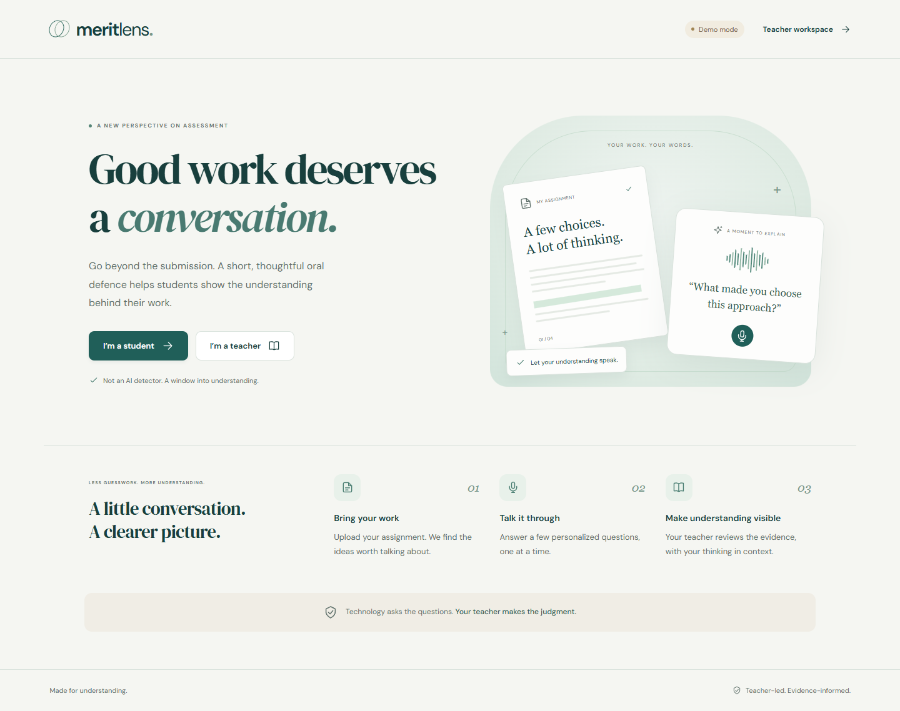

# Merit Lens

I made Merit Lens to help teachers check if students really understand the work they submit.

It is not an AI detector. The student uploads their work, answers a short oral defence based on it, and the teacher reviews the answers and final report.

**Project website:** https://meritlens.netlify.app/

The website above explains the idea. The full application is inside this repository and runs locally.



## What it does

- Teacher creates an assignment and questions
- Student uploads PDF, DOCX, TXT or pasted text
- AI creates questions based on the student's own work
- Questions can be spoken using ElevenLabs
- Student can answer by voice or text
- Teacher gets a report with the answers and areas to review

## Technologies I used

For the frontend, I used React and Vite.

For the backend, I used Node.js, Express and SQLite. I also used OpenAI for the analysis, ElevenLabs for voice, and Playwright for testing.

## Run it

You need Node.js 22.18 or newer.

```bash
npm install
npm run dev
```

Then open:

```text
http://127.0.0.1:5173
```

## API keys

Copy the example file:

```bash
cp .env.example .env
```

Then add your own OpenAI and ElevenLabs keys inside `.env`.

I do not keep the real API keys inside GitHub.

## Tests

```bash
npm test
npm run build
npm run test:ui
```

## Important

The teacher and student roles in this version are made for the hackathon demo. There is no real authentication yet, so I would not use real student data on a public deployment.
